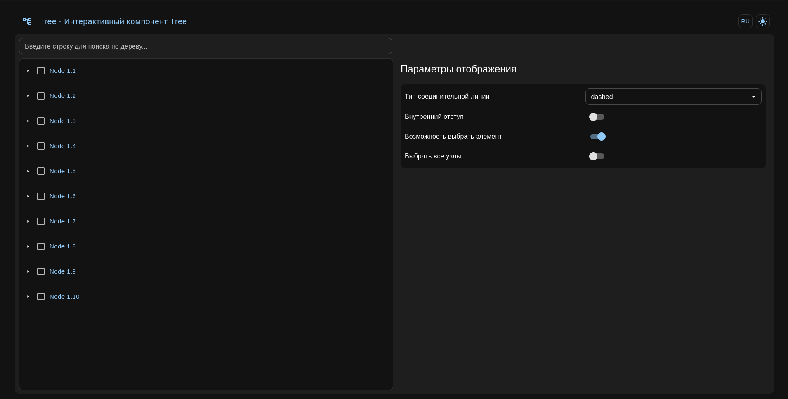
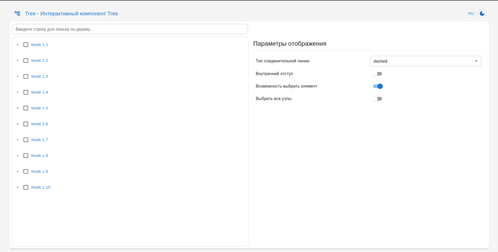

# What's it?

it's a project for understanding how to develop react interactive tree without helped from other libs.

<p align="center">
  
</p>
<p align="center">
  
</p>

# What's us need for create tree component?

Of course, the first stage is searching examples:
- [Rsuite Tree](https://rsuitejs.com/components/tree/)
- [Quasar Tree](https://quasar.dev/vue-components/tree)
- [Blueprintjs Tree](https://blueprintjs.com/docs/#core/components/tree)

Ok, we are having good examples and common information about types of structure.

we'll not take as an example tree component from MUI, i don't like this component.

## Let's write a function for generating nodes
```typescript

export const genDataItems = (
  depth = 5,
  childrenCount = 10,
  label = 'Node 1'
): TreeNode[] => {
  // max depth is 5 =)
  if (depth === 0 || depth > 5) {
    return []
  }
  return new Array(childrenCount).fill({}).map((_, index) => ({
    id: `id-${label}.${index + 1}`,
    label: `${label}.${index + 1}`,
    children: genDataItems(depth - 1, childrenCount, `${label}.${index + 1}`),
  }))
}
``` 

## Let's write a function for filtering nodes

```typescript
export const filterNodesByKey = (
  nodes: TreeNode[],
  filter: string
): TreeNode[] => {
  const filterNodes = (
    node: TreeNode,
    parents: TreeNode[] = []
  ): TreeNode | null => {
    let res = null

    const filteredChildren = node.children
      ?.map((childNode) => filterNodes(childNode, [...parents, node]))
      .filter((i) => i !== null)

    const hasChildrenMatched = filteredChildren && filteredChildren.length > 0
    const isNodeItselfMatched = node.label
      .toLocaleUpperCase()
      .includes(filter.toLocaleUpperCase())

    if (isNodeItselfMatched || hasChildrenMatched) {
      res = { ...node, children: filteredChildren } as TreeNode
    }

    return res
  }

  const result = nodes
    .map((node) => filterNodes(node, []))
    .filter((i) => i !== null) as TreeNode[]

  return (Array.isArray(result) && result) || []
}
```

Great, we have base utils fro creating Components

## Let's write types for component

```typescript
export interface TreeProps {
  connectorLineType?: ConnectorLineType
  dense?: Dense
  nodes: TreeNode[]
  filter?: string
  isChecked?: boolean
  checked?: string[]
  expanded?: string[]
  onChecked?: (checked: string[]) => void
  onExpanded?: (expanded: string[]) => void
}
```

for checked, expanded we will use context
```typescript
export const TreeContext = React.createContext<TreeContextProps | null>({
  checked: [],
  setChecked: () => {},
  expanded: [],
  setExpanded: () => {},
})

export const TreeProvider = TreeContext.Provider
```

and customHook 
```typescript
export const useAppContext = () => {
  const data = useContext(TreeContext)
  if (!data) {
    throw new Error('Can not `useAppContext` outside of the `TreeProvider`')
  }
  return data
}
```

I think now we can develop TreeNode component, which will work as recursive function
[source](/src/components/Tree/TreeNode.tsx)


## features

- ToggleLocale - control locale (ru/en)
- ToggleTheme - control theme mode (light/dark)
- TreeControl - control base options for Tree component